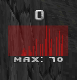

# dps-widget

dps-widget is an add-on for GZDoom that displays DPS (damage per second).

This mod is a part of [m8f's toolbox](https://mmaulwurff.github.io/pages/toolbox).

## Features

- DPS display
- history up to 1-minute
- graph
- max
- average
- total
- customizable looks
- invulnerable target (bind keys)

## Known Issues

- when changing history size, data updates after a second, and the graph may
  look wrong for a second.

## License

Code: GPLv3

[Target sprite](https://commons.wikimedia.org/wiki/File:WA_80_cm_archery_target.svg):
Creative Commons [Attribution-Share Alike 2.5 Generic](https://creativecommons.org/licenses/by-sa/2.5/deed.en) license, author: Alberto Barbati
